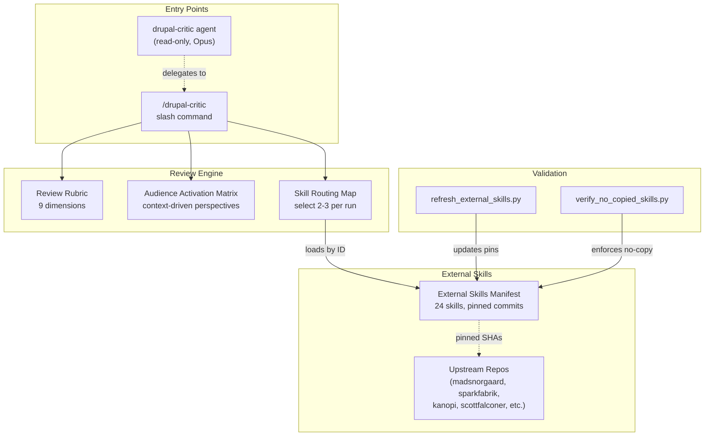
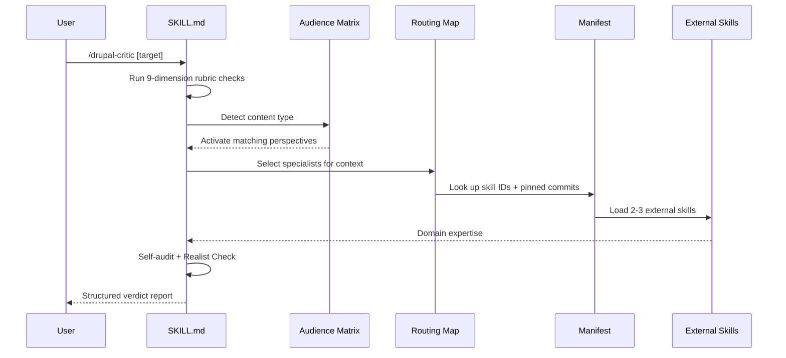

# drupal-critic Index

## Repo Facts

- Path: /Users/webchick/Documents/Codex/2026-04-17-research-drupal-ai-tooling-landscape-synthesis-2/research/repos/drupal-critic
- Last commit date: 2026-03-27 11:51:45 -0400
- Skill count (SKILL.md): 1

## Presence / Absence

- CLAUDE.md: yes
- AGENTS.md: no
- skills/: no
- .claude/skills/: yes
- agents/: no
- commands/: no
- hooks/: no
- .claude/: yes
- prompts/: no
- evals/: no
- composer.json: no
- package.json: no
- skills.yaml: no
- Any SKILL.md files: yes

## File Tree (Depth 3)

~~~text
.
./.claude
./.claude/agents
./.claude/agents/drupal-critic.md
./.claude/skills
./.claude/skills/drupal-critic
./.github
./.github/workflows
./.github/workflows/pages.yml
./.github/workflows/validate.yml
./.gitignore
./CLAUDE.md
./CONTRIBUTING.md
./INDEX.md
./LICENSE
./README.md
./docs
./docs/index.html
./research
./research/drupal-skills
./research/drupal-skills/raw
./research/drupal-skills/reports
./research/drupal-skills/scripts
./scripts
./scripts/refresh_external_skills.py
./scripts/verify_no_copied_skills.py
~~~

## File Type Counts

~~~text
.csv	1
.html	1
.json	4
.md	16
.py	3
.tsv	1
.txt	1
.yaml	2
.yml	2
[dotfile-no-ext]	1
[no-ext]	1
~~~

## README (First 200 Lines)

Source: README.md

~~~text
# drupal-critic

> **This repository has been consolidated into [drupal-meta-skills](https://github.com/zivtech/drupal-meta-skills).**
> Use the consolidated repo for new installs and updates. It now contains the Drupal planner, the critic, and the config executor in one bundle.

A Drupal-specific review skill for [Claude Code](https://docs.anthropic.com/en/docs/claude-code) that layers domain expertise on top of [harsh-critic](https://github.com/zivtech/harsh-critic)'s structured investigation protocol. It adds Drupal-specific checks — cache correctness, config workflow safety, contrib-first decisions, render security, migration idempotency — and activates context-driven review perspectives that generic reviewers don't know to apply.

**[Visual Explainer](https://zivtech.github.io/drupal-critic/)** | [harsh-critic](https://github.com/zivtech/harsh-critic) (companion project)

## The problem with generic Drupal reviews

General-purpose reviewers can catch logic bugs and security oversights, but they miss Drupal-specific failure modes: cache tags that don't invalidate, config exports that break on deploy, contrib modules reimplemented as custom code, update hooks that aren't idempotent, and editorial workflows that make content editors' lives harder. These issues require domain knowledge that generic review prompts don't carry.

## How it works

drupal-critic extends harsh-critic's protocol (pre-commitment, verification, multi-perspective, gap analysis, self-audit, realist check, synthesis) and includes plan-specific investigation checks, a mandatory confidence-gated self-audit before verdict, and a Realist Check that pressure-tests CRITICAL/MAJOR findings for real-world severity — downgrading when impact doesn't match the label while never downgrading data loss, security breaches, or financial impact.

### Drupal review rubric

Every review checks 9 dimensions tuned to Drupal's architecture:

1. **Security** — routes, entity queries, input validation, safe Twig rendering, SQL builder usage
2. **Architecture** — contrib-first decisions, dependency injection patterns, hooks vs. subscribers vs. plugins, config schema
3. **Open Source** — upstream patch viability, issue queue research, contrib maintenance burden
4. **Site Builder** — admin UX, permissions, workflows, config stability, Drush alignment
5. **Content Editor** — editorial workflow clarity, authoring UX, metadata/SEO, editing friction
6. **Operational Safety** — update/rollback path, Composer constraints, Drush steps, error handling
7. **Caching** — tags/contexts/max-age correctness, personalization handling, BigPipe/lazy builders
8. **Testing** — proportional test strategy, risky path validation, acceptance checks
9. **Confidence** — evidence-backed findings vs. speculative concerns

### Context-driven audience activation

Three perspectives always run: **Security**, **New-hire**, **Ops**.

Three more activate based on what's being reviewed:

- **Open Source Contributor** — activates when contrib/core behavior is overridden in custom code, a bugfix targets leveraged third-party code, or a change introduces long-term patch maintenance burden. Asks: should this become an upstream patch? Is custom code duplicating behavior that belongs in contrib?

- **Site Builder (Drupal Admin UI)** — activates when changes touch content types, views, display modes, workflows, moderation, permissions, menus, media, or admin config pages. Asks: can site builders manage this in UI without developer-only steps? Are config dependencies understandable and stable?

- **Content Editor/Marketer** — activates when changes affect editorial workflow, content authoring UX, content model, metadata/SEO, campaign pages, or publishing cadence. Asks: does this increase editorial friction? Are metadata/SEO and governance needs covered?

### External skill orchestration

Instead of vendoring Drupal knowledge into a single monolithic prompt, drupal-critic references 24 external specialist skills by ID with pinned commit SHAs. Each review run loads max 2-3 relevant skills selected via a routing map — keeping context focused and up-to-date with upstream improvements.

Each skill carries a **JTBD (Jobs-To-Be-Done) statement** in the routing map: "When [situation], I want to [motivation], so I can [expected outcome]." The agent matches the review context against these statements to select the right specialist skills — rather than relying on category labels and priority alone. Overlapping skills (e.g., the three DDEV/tooling skills) are explicitly disambiguated by situation.

### Architecture overview

```
.claude/skills/drupal-critic/
├── SKILL.md                          # Review protocol, output contract, routing rules
├── references/
│   ├── external-skills-manifest.yaml # 24 external skills with pinned commits (source of truth)
│   ├── drupal-review-rubric.md       # 9-dimension review checklist
│   ├── audience-activation-matrix.md # Which perspectives activate for which content
│   └── skill-routing-map.md          # How to select max 2-3 external skills per review run
└── agents/
    └── openai.yaml                   # OpenAI interface metadata

.claude/agents/
└── drupal-critic.md                  # Read-only agent prompt (disallows Write/Edit)

scripts/
├── refresh_external_skills.py        # Manifest pin updater
└── verify_no_copied_skills.py        # Policy enforcement
```



<details>
<summary>Review sequence (runtime flow)</summary>



</details>

## Output format

Same structured report as harsh-critic, with Drupal-specific findings woven into each section:

- **Verdict**: REJECT / REVISE / ACCEPT-WITH-RESERVATIONS / ACCEPT
- **Overall assessment**: 2-3 sentence quality summary
- **Pre-commitment predictions**: Expected Drupal-specific problem areas vs. actual findings
- **Critical findings**: Blocks execution. Must include `file:line` evidence.
- **Major findings**: Causes significant rework. Must include evidence.
- **Minor findings**: Suboptimal but functional.
- **What's missing**: Gaps, unhandled edge cases, unstated assumptions.
- **Ambiguity risks** (plan reviews only): Multiple valid interpretations with consequence if the wrong one is chosen.
- **Multi-perspective notes**: Security, new-hire, ops, and activated Drupal perspectives.
- **Verdict justification**: Why this verdict, what would upgrade it, and whether adversarial escalation was triggered.
- **Open questions (unscored)**: Speculative or low-confidence concerns moved out of scored sections.

## Relationship with harsh-critic

harsh-critic provides the general-purpose structured investigation protocol. drupal-critic adds domain-specific checks on top:

| | harsh-critic | drupal-critic |
|---|---|---|
| **Scope** | Any code, plan, or analysis | Drupal modules, themes, config, deploy workflows |
| **Perspectives** | Security, new-hire, ops | Same core + Open Source Contributor, Site Builder, Content Editor |
| **Domain checks** | None — general-purpose | 9-dimension Drupal rubric (cache, config, contrib, migrations, etc.) |
| **External skills** | None | Orchestrates up to 3 of 24 pinned external Drupal skills per run |
| **Best used for** | General code/plan review | Module updates, cache behavior, config sync, migration plans, contrib patches |

For Drupal-heavy changes, run drupal-critic first. Optionally follow with harsh-critic as a second-pass general review.

## Referenced external skills

drupal-critic coordinates 24 external skills across 6 categories, pinned to specific commits for reproducibility:

### Core Review

- [**drupal-expert**](https://github.com/madsnorgaard/agent-resources) by madsnorgaard — Drupal 10/11 development expertise covering modules, themes, hooks, services, configuration, and migrations. Enforces contrib-first research and dependency injection.
- [**drupal-security**](https://github.com/madsnorgaard/agent-resources) by madsnorgaard — Proactively identifies security vulnerabilities (XSS, SQL injection, access bypass) while Drupal code is being written, not after.
- [**drupal-update**](https://github.com/bethamil/agent-skills) by bethamil — Automates Drupal module updates in DDEV environments with safety snapshots, composer update, drush updb, config export, and changelog generation.
- [**drupal-development**](https://github.com/mindrally/skills) by mindrally — Drupal development guidelines and best practices, part of a 240+ skill collection converted from Cursor rules.

### Contrib & Issue Queue

- [**drupal-issue-queue**](https://github.com/scottfalconer/drupal-issue-queue) by scottfalconer — Searches Drupal.org issue queues and summarizes individual issues for triage using drupalorg-cli and the Drupal.org API.
- [**drupal-contribute-fix**](https://github.com/scottfalconer/drupal-contribute-fix) by scottfalconer — Searches Drupal.org before writing code changes to contrib/core, then packages contribution-ready artifacts (diffs, issue comments, reports).
- [**drupalorg-issue-helper**](https://github.com/kanopi/cms-cultivator) by Kanopi Studios — Helps write Drupal.org issue reports with proper HTML templates, formatting, and best practices for bug reports and feature requests.
- [**drupalorg-contribution-helper**](https://github.com/kanopi/cms-cultivator) by Kanopi Studios — Guides Drupal.org contribution workflows including git commands, issue fork setup, branch naming, and merge request creation.

### Cache & Rendering

- [**drupal-cache-contexts**](https://github.com/sparkfabrik/sf-awesome-copilot) by SparkFabrik — Cache context selection and usage patterns for request-dependent content variations.
- [**drupal-cache-tags**](https://github.com/sparkfabrik/sf-awesome-copilot) by SparkFabrik — Cache tag assignment and invalidation patterns for Drupal's data-dependent cache layer.
- [**drupal-cache-maxage**](https://github.com/sparkfabrik/sf-awesome-copilot) by SparkFabrik — Time-based cache expiration configuration and max-age propagation in Drupal's render pipeline.
- [**drupal-dynamic-cache**](https://github.com/sparkfabrik/sf-awesome-copilot) by SparkFabrik — Dynamic page cache behavior, auto-placeholdering, and per-user content handling.
- [**drupal-cache-debugging**](https://github.com/sparkfabrik/sf-awesome-copilot) by SparkFabrik — Techniques for diagnosing cache misses, stale content, and incorrect cache metadata.
- [**drupal-lazy-builders**](https://github.com/sparkfabrik/sf-awesome-copilot) by SparkFabrik — Lazy builder pattern for deferring render-heavy or uncacheable content out of the main response.

### Canvas/Components

- [**canvas-component-definition**](https://github.com/drupal-canvas/skills) by Drupal Canvas — Defining Canvas Code Components for Drupal's visual page builder.
- [**canvas-component-metadata**](https://github.com/drupal-canvas/skills) by Drupal Canvas — Component metadata schemas and prop definitions for Canvas components.
- [**canvas-component-utils**](https://github.com/drupal-canvas/skills) by Drupal Canvas — Utility functions and helpers for Canvas component development.
- [**canvas-data-fetching**](https://github.com/drupal-canvas/skills) by Drupal Canvas — Data fetching patterns for server-side and client-side data in Canvas components.
- [**canvas-styling-conventions**](https://github.com/drupal-canvas/skills) by Drupal Canvas — CSS and styling conventions for Canvas Code Components.
- [**canvas-component-composability**](https://github.com/drupal-canvas/skills) by Drupal Canvas — Patterns for nesting and composing Canvas components together.
- [**canvas-component-upload**](https://github.com/drupal-canvas/skills) by Drupal Canvas — Packaging and uploading Canvas components to a Drupal site.

### Tooling

- [**drupal-ddev**](https://github.com/grasmash/drupal-claude-skills) by grasmash — DDEV local development patterns for Drupal including configuration, database management, Xdebug, and performance optimization.
- [**drupal-tooling**](https://github.com/omedia/drupal-skill) by Omedia — Drupal development tooling for DDEV environments and Drush command-line operations across Drupal 8–11+.

~~~

## License

Source: LICENSE

~~~text
Apache License
Version 2.0, January 2004
http://www.apache.org/licenses/

TERMS AND CONDITIONS FOR USE, REPRODUCTION, AND DISTRIBUTION

1. Definitions.

"License" shall mean the terms and conditions for use, reproduction,
and distribution as defined by Sections 1 through 9 of this document.

"Licensor" shall mean the copyright owner or entity authorized by
the copyright owner that is granting the License.

"Legal Entity" shall mean the union of the acting entity and all
other entities that control, are controlled by, or are under common
control with that entity. For the purposes of this definition,
"control" means (i) the power, direct or indirect, to cause the
direction or management of such entity, whether by contract or
otherwise, or (ii) ownership of fifty percent (50%) or more of the
outstanding shares, or (iii) beneficial ownership of such entity.

"You" (or "Your") shall mean an individual or Legal Entity
exercising permissions granted by this License.

"Source" form shall mean the preferred form for making modifications,
including but not limited to software source code, documentation
source, and configuration files.

"Object" form shall mean any form resulting from mechanical
transformation or translation of a Source form, including but
not limited to compiled object code, generated documentation,
and conversions to other media types.

"Work" shall mean the work of authorship, whether in Source or
Object form, made available under the License, as indicated by a
copyright notice that is included in or attached to the work
(an example is provided in the Appendix below).

"Derivative Works" shall mean any work, whether in Source or Object
form, that is based on (or derived from) the Work and for which the
editorial revisions, annotations, elaborations, or other modifications
represent, as a whole, an original work of authorship. For the purposes
of this License, Derivative Works shall not include works that remain
separable from, or merely link (or bind by name) to the interfaces of,
the Work and Derivative Works thereof.

"Contribution" shall mean any work of authorship, including
the original version of the Work and any modifications or additions
to that Work or Derivative Works thereof, that is intentionally
submitted to Licensor for inclusion in the Work by the copyright owner
or by an individual or Legal Entity authorized to submit on behalf of
the copyright owner. For the purposes of this definition, "submitted"
means any form of electronic, verbal, or written communication sent
to the Licensor or its representatives, including but not limited to
communication on electronic mailing lists, source code control systems,
and issue tracking systems that are managed by, or on behalf of, the
Licensor for the purpose of discussing and improving the Work, but
excluding communication that is conspicuously marked or otherwise
designated in writing by the copyright owner as "Not a Contribution."

"Contributor" shall mean Licensor and any individual or Legal Entity
on behalf of whom a Contribution has been received by Licensor and
subsequently incorporated within the Work.

2. Grant of Copyright License. Subject to the terms and conditions of
this License, each Contributor hereby grants to You a perpetual,
worldwide, non-exclusive, no-charge, royalty-free, irrevocable
copyright license to reproduce, prepare Derivative Works of,
publicly display, publicly perform, sublicense, and distribute the
Work and such Derivative Works in Source or Object form.

3. Grant of Patent License. Subject to the terms and conditions of
this License, each Contributor hereby grants to You a perpetual,
worldwide, non-exclusive, no-charge, royalty-free, irrevocable
(except as stated in this section) patent license to make, have made,
use, offer to sell, sell, import, and otherwise transfer the Work,
where such license applies only to those patent claims licensable
by such Contributor that are necessarily infringed by their
Contribution(s) alone or by combination of their Contribution(s)
with the Work to which such Contribution(s) was submitted. If You
institute patent litigation against any entity (including a
cross-claim or counterclaim in a lawsuit) alleging that the Work
or a Contribution incorporated within the Work constitutes direct
or contributory patent infringement, then any patent licenses
granted to You under this License for that Work shall terminate
as of the date such litigation is filed.

4. Redistribution. You may reproduce and distribute copies of the
Work or Derivative Works thereof in any medium, with or without
modifications, and in Source or Object form, provided that You
meet the following conditions:

(a) You must give any other recipients of the Work or
Derivative Works a copy of this License; and

(b) You must cause any modified files to carry prominent notices
stating that You changed the files; and

(c) You must retain, in the Source form of any Derivative Works
that You distribute, all copyright, patent, trademark, and
attribution notices from the Source form of the Work,
excluding those notices that do not pertain to any part of
the Derivative Works; and

(d) If the Work includes a "NOTICE" text file as part of its
distribution, then any Derivative Works that You distribute must
include a readable copy of the attribution notices contained
within such NOTICE file, excluding those notices that do not
pertain to any part of the Derivative Works, in at least one
of the following places: within a NOTICE text file distributed
as part of the Derivative Works; within the Source form or
documentation, if provided along with the Derivative Works; or,
within a display generated by the Derivative Works, if and
wherever such third-party notices normally appear. The contents
of the NOTICE file are for informational purposes only and
do not modify the License. You may add Your own attribution
notices within Derivative Works that You distribute, alongside
or as an addendum to the NOTICE text from the Work, provided
that such additional attribution notices cannot be construed
as modifying the License.

You may add Your own copyright statement to Your modifications and
may provide additional or different license terms and conditions
for use, reproduction, or distribution of Your modifications, or
for any such Derivative Works as a whole, provided Your use,
reproduction, and distribution of the Work otherwise complies with
the conditions stated in this License.

5. Submission of Contributions. Unless You explicitly state otherwise,
any Contribution intentionally submitted for inclusion in the Work
by You to the Licensor shall be under the terms and conditions of
this License, without any additional terms or conditions.

6. Trademarks. This License does not grant permission to use the trade
names, trademarks, service marks, or product names of the Licensor,
except as required for reasonable and customary use in describing the
origin of the Work and reproducing the content of the NOTICE file.

7. Disclaimer of Warranty. Unless required by applicable law or
agreed to in writing, Licensor provides the Work (and each
Contributor provides its Contributions) on an "AS IS" BASIS,
WITHOUT WARRANTIES OR CONDITIONS OF ANY KIND, either express or
implied, including, without limitation, any warranties or conditions
of TITLE, NON-INFRINGEMENT, MERCHANTABILITY, or FITNESS FOR A
PARTICULAR PURPOSE. You are solely responsible for determining the
appropriateness of using or redistributing the Work and assume any
risks associated with Your exercise of permissions under this License.

8. Limitation of Liability. In no event and under no legal theory,
whether in tort (including negligence), contract, or otherwise,
unless required by applicable law (such as deliberate and grossly
negligent acts) or agreed to in writing, shall any Contributor be
liable to You for damages, including any direct, indirect, special,
incidental, or consequential damages of any character arising as a
result of this License or out of the use or inability to use the
Work (including but not limited to damages for loss of goodwill,
work stoppage, computer failure or malfunction, or any and all
other commercial damages or losses), even if such Contributor
has been advised of the possibility of such damages.

9. Accepting Warranty or Additional Liability. While redistributing
the Work or Derivative Works thereof, You may choose to offer,
and charge a fee for, acceptance of support, warranty, indemnity,
or other liability obligations and/or rights consistent with this
License. However, in accepting such obligations, You may act only
on Your own behalf and on Your sole responsibility, not on behalf
of any other Contributor, and only if You agree to indemnify,
defend, and hold each Contributor harmless for any liability
incurred by, or claims asserted against, such Contributor by reason
of your accepting any such warranty or additional liability.

END OF TERMS AND CONDITIONS

~~~
