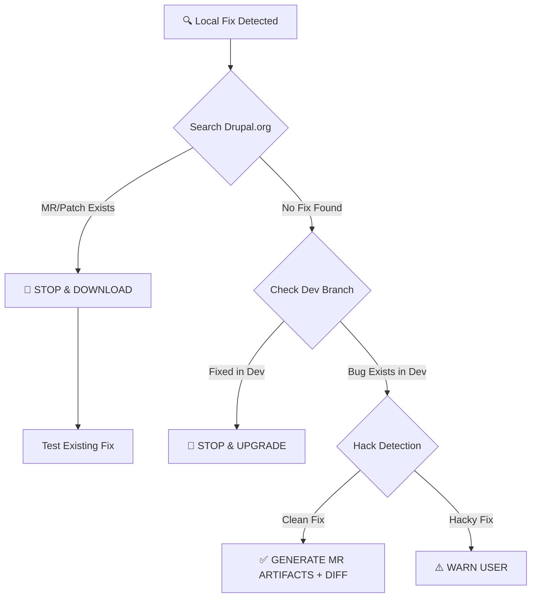

# scottfalconer-drupal-contribute-fix — Structural Index

**Source URL**: https://github.com/scottfalconer/drupal-contribute-fix
**Clone URL used**: https://github.com/scottfalconer/drupal-contribute-fix
**Last commit**: 2026-03-03 10:13:13 -0700
**Last commit subject**: Use drupalorg-cli when available
**License**: LICENSE
**Default branch**: refs/heads/main

## File type counts

     16 py
      7 md
      1 txt
      1 /LICENSE
      1 gitignore

## Presence of key files/dirs

- CLAUDE.md: ✗ absent
- AGENTS.md: ✗ absent
- README: ✓ present (README.md)
- skills/ : ✗ absent
- .claude/ : ✗ absent
- .claude/skills/ : ✗ absent
- agents/ : ✗ absent
- commands/ : ✗ absent
- hooks/ : ✗ absent
- prompts/ : ✗ absent
- evals/ : ✗ absent
- composer.json: ✗ absent
- package.json: ✗ absent
- skills.yaml: ✗ absent
- .cursorrules / .cursor/ : ✗ absent
- .github/ : ✗ absent

## SKILL.md count

Number of SKILL.md files: 1

Paths:

```
./SKILL.md
```

## File tree (depth 3)

```
.
./examples
./examples/sample-report.md
./lib
./lib/baseline_repo.py
./lib/drupalorg_api.py
./lib/drupalorg_urls.py
./lib/__init__.py
./lib/issue_matcher.py
./lib/issue_queue_integration.py
./lib/patch_packager.py
./lib/report_writer.py
./lib/security_detector.py
./lib/validator.py
./LICENSE
./README.md
./references
./references/core-testing.md
./references/hack-patterns.md
./references/issue-status-codes.md
./references/patch-conventions.md
./requirements.txt
./scripts
./scripts/contribute_fix.py
./SKILL.md
./tests
./tests/test_contribute_fix_test_command.py
./tests/test_drupalorg_urls.py
./tests/test_issue_queue_integration.py
./tests/test_patch_packager.py
./tests/test_report_writer_mr_workflow.py
```

## README first 200 lines

Source: README.md

```
# drupal-contribute-fix


**Turn local Drupal fixes into effortless, maintainer-friendly contributions.**

AI scales code generation, but it shouldn't scale noise.

We want to empower AI Agents to fix Drupal bugs, while protecting maintainers from
a flood of duplicate or low-quality contributions. This tool bridges the gap,
transforming the Agent from a "local hacker" into a **responsible open-source contributor**.

### Our Mission: High Signal, Zero Noise
To ensure contributions are helpful rather than overwhelming, this skill enforces three strict rules:
1. **Targeted:** Searches Drupal.org first. If a fix exists, we stop and recommend using it. No duplicate effort.
2. **High-Quality:** Runs PHP lint by default; runs PHPCS if available; flags hack patterns.
3. **Maintainer-First:** Never auto-posts. Generates clean artifacts for **you** to review.

---

## 📖 Table of Contents

- [Why Use This?](#why-use-this)
- [What This Will NOT Do](#what-this-will-not-do)
- [How It Works](#how-it-works)
- [What You Get](#what-you-get)
- [Quick Start](#quick-start)
- [DDEV + drupalorg-cli Setup (Recommended)](#ddev--drupalorg-cli-setup-recommended)
- [Workflow Modes](#workflow-modes)
- [Options](#options)
- [Exit Codes (Gatekeeper Behavior)](#exit-codes-gatekeeper-behavior)
- [For AI Agent Developers](#for-ai-agent-developers)

---

## Why Use This?

**Stop your AI from "hacking" core.**

| :x: Without this Skill | :white_check_mark: With `drupal-contribute-fix` |
| :--- | :--- |
| **Duplicate Work:** Agent ignores existing MRs/patches. | **Upstream-aware:** Searches Drupal.org and surfaces existing fixes. |
| **Tech Debt:** Fixes are buried in `vendor/` or `core/`. | **Standardized:** Generates local `.diff` review artifacts in `diffs/`. |
| **Maintainer Burnout:** Spammy, low-quality issues. | **Maintainer-friendly:** Warns on risky patterns and keeps human review in the loop. |
| **Lost Fixes:** Local work vanishes on `composer update`. | **Preserved Work:** Artifacts are saved for future MR follow-up. |
| **No Validation:** Errors slip through. | **Quality Gates:** Runs PHP lint and PHPCS (if available). |

---

## What This Will NOT Do

**This skill is designed to be helpful without creating churn.**

| :no_entry_sign: Never | :white_check_mark: Instead |
|:---|:---|
| Auto-post to Drupal.org | Generates files for **you** to review and paste |
| Create issues automatically | Searches existing issues; you decide what to file |
| Push to git.drupalcode.org | Outputs local artifacts only (comment + `.diff`) |
| Bypass your review | Every artifact requires human approval before submission |
| Spam maintainers | Stops when existing MR/patch found; encourages testing over duplicating |

### The "No Noise" Guarantee
This tool never auto-posts to Drupal.org or pushes code automatically. It only generates
local artifacts for you to review and submit.

**The `--force` flag should be rare.** Use it only when:
- You've reviewed the existing MR/patch and confirmed your fix is meaningfully different
- You're providing a reroll for a different version
- The existing fix doesn't apply to your Drupal version

When using `--force`, always explain in your issue comment why a local `.diff` artifact was needed.

---

## How It Works



*Note: Dev-branch checks are currently a manual step; the tool does not auto-verify them yet.*

---

## What You Get

```
.drupal-contribute-fix/
├── UPSTREAM_CANDIDATES.json           # Search results cache (shared)
├── 3345678-fix-metatag-build/         # Known issue with slug
│   ├── REPORT.md                      # Analysis & next steps
│   ├── ISSUE_COMMENT.md               # Copy/paste this to drupal.org
│   └── diffs/
│       └── metatag-fix-3345678.diff   # Local review artifact
└── unfiled-update-module-check/       # New issue needed
    ├── REPORT.md
    ├── ISSUE_COMMENT.md
    └── diffs/
        └── project-fix-new.diff
```

**Directory naming:** `{nid}-{slug}/` for existing issues, `unfiled-{slug}/` for new issues.

---

## Quick Start

### Prerequisites

- Python 3.8+
- Git
- Internet access to drupal.org API
- DDEV (recommended for running `drupalorg-cli`)
- PHP 8.1+ in the runtime where `drupalorg-cli` executes

### Installation

```bash
# Clone from your preferred location
git clone <repository-url>
cd drupal-contribute-fix
```

## DDEV + drupalorg-cli Setup (Recommended)

This skill now recommends `drupalorg-cli` for issue-fork/MR/pipeline execution.
If your host PHP is older, run `drupalorg-cli` inside DDEV.

Install a global DDEV command:

```bash
mkdir -p ~/.ddev/commands/web
cat > ~/.ddev/commands/web/drupalorg <<'EOF'
#!/usr/bin/env bash
## Description: Run drupalorg-cli inside the web container
## Usage: drupalorg [args]
## ProjectTypes: drupal,drupal11,drupal10,drupal9,drupal8,drupal7,backdrop,php
## ExecRaw: true
set -euo pipefail
PHAR="/mnt/ddev-global-cache/drupalorg-cli/drupalorg.phar"
URL="https://github.com/mglaman/drupalorg-cli/releases/latest/download/drupalorg.phar"
mkdir -p "$(dirname "$PHAR")"
if [ ! -x "$PHAR" ]; then
  curl -fsSL "$URL" -o "$PHAR"
  chmod +x "$PHAR"
fi
exec php "$PHAR" "$@"
EOF
chmod +x ~/.ddev/commands/web/drupalorg
```

Optional shell alias:

```bash
alias drupalorg='ddev drupalorg'
```

Verify in a DDEV project directory:

```bash
ddev restart
ddev drupalorg --version
```

### Usage

**Search only (preflight):**
```bash
python3 scripts/contribute_fix.py preflight \
  --project metatag \
  --keywords "TypeError MetatagManager" \
  --out .drupal-contribute-fix
```

Tip: Drupal.org's `api-d7` endpoint does **not** support a full-text `text=` filter (it returns HTTP 412). For manual keyword searching, use the Drupal.org UI search:

```text
https://www.drupal.org/project/issues/search/<project>?text=<keywords>
```

## Companion Tool: drupal-issue-queue (optional)

For deeper triage (filters by status/priority/category/version/component/tag) and issue/thread summaries via `api-d7`, use the companion tool `drupal-issue-queue` (GitHub repo: `scottfalconer/drupal-issue-queue`).

Common examples (run from the `drupal-issue-queue` directory):

```bash
# Summarize an issue (Markdown)
python scripts/dorg.py issue <nid-or-url> --format md
```
